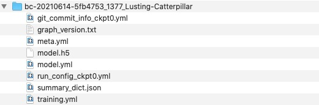
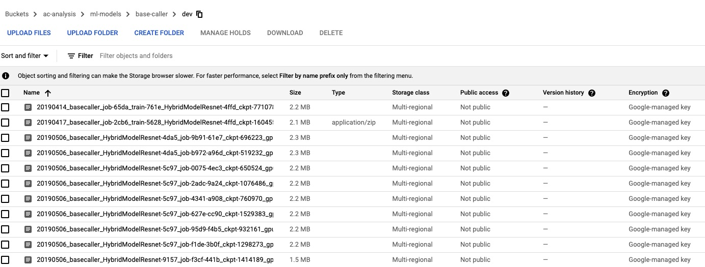
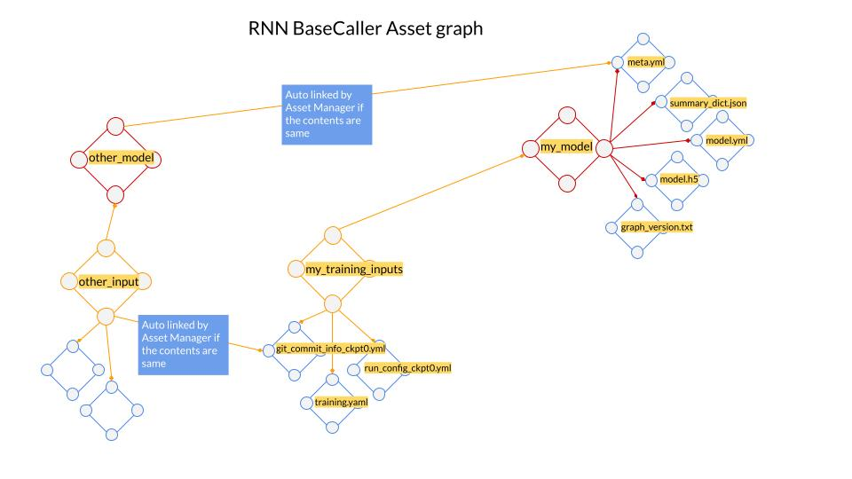

### RNN BaseCaller Model Training
#### Status Quo
The DLTraining pipeline is executed in airflow + AIPlatform to train RNNBaseCaller models. The pipeline
to train a single model involves a series of steps. Broadly it can be explained as follows:

* Packaging the RNNBaseCaller code and uploading to AIPlatform
* Launching AI Platform jobs in sequence for multiple stages
* Evaluating checkpoints in parallel to determine the least loss checkpoint
* Freezing and uploading the model to artifactory/bucket
* Testing to ensure model integrity

The output of DLTraining pipeline is a zip file which has the following structure. All models are stored in a gcp bucket.

The current structure presents the following challenges when it comes to lineage of models.

* There is no meta tracking of models.
* There is no summary of parameters, code, data used for a specific model and comparison across models.
* To understand the lineage of a model, user has to manually open the zip and examine the individual files 

#### How BaseAsset Manager can help
##### Tracking
BaseAsset Manager can help solve the problems described above including uploading, managing and sharing of models.
In order to understand the steps involved, we need to elaborate a bit on the information within the zip archive.
The files within the archive can be broadly classified into the following:

<pre class="code">
Inputs
git_commit_info_ckpt0.yml (contains git commit hashes for base_caller repo)
run_config_ckpt0.yml (generated before model_freezing step)
training.yml (contains parameters and datasets used for training)

Outputs
graph_version.txt (tensorflow graph version number)
meta.yml (human readable description and training date)
model.h5 (model file)
model.yml (parameters, shape and layers of the model) 
summary_dict.json (training meta data)
</pre>

User has to perform the following operations and BaseAsset Manager will take care of the rest. At the end of the model freezing (prior to uploading to bucket)
<pre class="code">
cd output_dir # parent dir of the files
# lets create the input assets first
asset init training_params
asset add git_commit_info_ckpt0.yml, run_config_ckpt0.yml, training.yml
asset set --alias my_training_inputs # user defined name
asset upload
</pre>
<pre class="code">
# now the output asset
asset init rnn_models
asset add graph_version.txt, meta.yml, model.h5, model.yml, summary_dict.json
asset set --alias my_model # user defined name
asset add ref --alias my_training_inputs # linking the two assets
asset upload
</pre>

Now in the asset manager dashboard (TBD), you can track the rnn_base_caller assets in the following manner.

##### Sharing
You can just pass the alias to your fellow teammates. They can use the following commands to download and use the asset.
<pre class="code">
# download the model assets
asset download rnn_base_caller --alias my_model
# download model asset including the any references
asset download rnn_base_caller --alias my_model --refs
</pre>

##### Comparing
You can find all models with the same model.yml file. We index based on content-hash so users are free to chose any names
for their files.

##### Lineage
You can find the history of every asset created.

* Created By
* Created At
* 

##### Access Control
