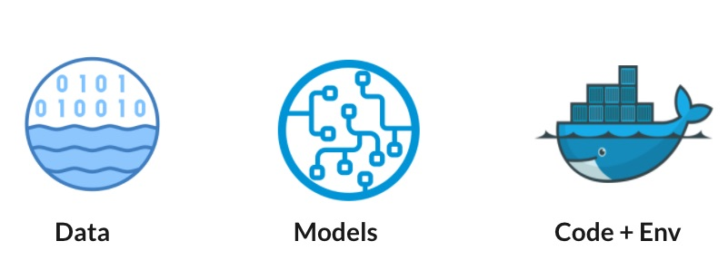

# Conceptual Model

### What is an BaseAsset?

We define the BaseAsset as a single or collection of digital resources. Digital resources can be data,
code or models etc. A good way to reason about this is basically anything that can be stored and retrieved.

**Examples of BaseAsset**



### How do we store an BaseAsset
In BaseAsset-Manager, assets are serialized to ```yaml``` files and stored in the gs bucket. Conceptually, an asset
holds a list of objects and other metadata. 

<pre class="code">
top_hash: 960e42d17d32483cb160f8adf4f8e456
class_name: gene_data
class_id: 483b14fa-b0ea-4cf0-8640-afdd76f8dcf1
created_by: mahantis
created_at: 2021-11-09T10-00-21-PST
objects:
- path: test_data/.DS_Store
  created_by: mahantis
  created_at: 2021-11-09T11-00-17-PST
  content:
    id: gs:md5$+MQfprqVrvt/hR5wQOHbRg==
    type: null
- path: test_data/2.txt
  created_by: mahantis
  created_at: 2021-11-09T11-00-17-PST
  content:
    id: gs:md5$4likqgIb3Sl86qIgmUcLmQ==
    type: text/plain
</pre>

The underlying content is stored separately in a bucket or other data-stores i.e. database, ftp etc depending on the
type and source of content.


### Why do I need BaseAsset Manager?

The BaseAsset Manager presents a shared hub to ensure that assets can be trusted, reused, 
and shared for greater efficiency and more accurate results over time, across collaborators, and in different machine environments

* **Trackability**: Know and lineage of every asset
* **Availability**: Run your experiments without worrying about how to plugin data. BaseAsset Manager will fetch the relevant dataset and make it available. Both locally and in cloud.
* **Shareability**: human friendly name to communicate assets.
* **Searchability**: Query and filter all data / metadata
* **Pipeline Integration**: seamlessly integrated into pipeline

 