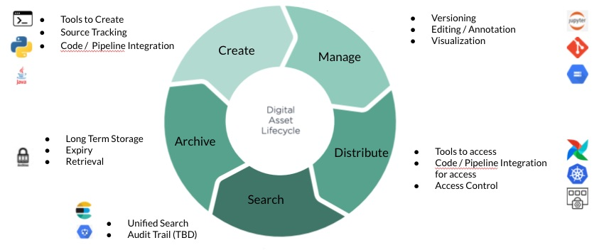

# Asset Manager

### Motivation
A majority of data pipelines consume or create some form of digital assets such as machine learning models, reference genomes, 
dna sequences etc. Digital Assets are increasingly becoming a central part of computing  activities within organizations. 
However, the traditional approaches to manage digital assets e.g. JFROG etc. are often inadequate, as they don’t provide 
tools to properly manage the whole life cycle of digital assets starting from creation, distribution, usage and retirement. Another 
dimension of a digital assets management system is exploration, visualization, permission control, code integration. 
In addition, healthcare companies like Roche, it’s also important to track the data, code and algorithms which went into creating the assets 
for regulatory purposes. We will call this feature as source tracing from now on. Currently no such tools exist which can provide an integrated 
management of digital assets. However some tools do exists which can solve a part of the overall  problems. E.g. JFROG can be used to distribute 
the digital assets however it severely lacks in terms of discoverability, source tracing, code integration. QuiltData can provide storage, 
distribution to geographically distributed teams as well as provide visualization and exploration of the data. 
However it works only on amazon web services and lacks support of google cloud which is our most dominant computing platform. 
In addition it doesn’t provide source tracing, permission control and limited code integration.

### Description
Genia asset manager is a project initiated by Data Science Automation Software Engineering to streamline the management of digital assets. 
The tool is being developed keeping in mind the need of data scientists, machine learning engineers and integrates well into existing and AlgFlow 
pipelines. BaseAsset manager will provide the following main functionalities:

#### Command Line Tool
BaseAsset manager would provide a command line tool which will be distributed as part of our deployment manager tool described earlier. 
This command line tool will help create digital assets and upload it to the asset management server, catalog it for distribution. 
The tool will also let users download assets and integrates with gdm to create a working development  environment along with all the necessary digital 
assets with a single command.

#### Code Level Integration
BaseAsset manager would also provide a library to create/download assets from python code. Other languages can also be supported later. The library would provide a 
declarative abstraction of assets in the  ACAP/Algflow pipeline, so that  assets  can be just declared within pipeline Annotators/Algorithms/Tasks 
without adding  any code to download/upload, whether running locally or in a cloud environment.

#### Source Tracing
Since we will have the asset management wired into all the data science pipelines eventually, the asset manager would capture the input and output assets in a 
pipeline along with all the configuration parameters as a graph. This would allow us to implement source tracing for assets created in the pipeline. 
For example, when we create a RNN based base calling machine learning model in a training pipeline. The trained model would be saved in asset manager 
stored along with the details of training data, configuration parameters, code version etc. which can be used to verify or retrain the model if needed. 

#### Search/Exploration
The asset manager would provide a web based search and exploration interface for all the assets managed within the system. The search functionality would be implemented 
using cloud based search backend such as elastic search. This would provide scalable and content based search. The exploration functionality would be 
customized based on the use cases and will evolve with the actual usage.

#### Visualization
The asset manager web interface would also include a mechanism to visualize the assets using custom plugins. E.g. if the asset is JSON it would provide  a JSON viewer by default. 
However you could also render it as a graph revealing more visual representation of the assets. This feature would evolve with usage.

#### Lifecycle Management
The data science artifacts go through creation, staging, production, retirement and archival. In a regulatory environment, it may also go through 
validation and certification stages. This necessitates a more flexible lifecycle management than current tools can provide. 
GDM asset manager would provide a lifecycle stages and policies customizable for every asset category ( or asset type). 
The assets belonging to same category will be treated using the same set of policies specified for that product. 
Please see the asset manager documentation for more details on the proposed lifecycle management features.

#### Permission  Control
The asset manager will implement user and group level permission control on the access, creation, change and lifecycle management aspect of the artifact. 
This feature will evolve based on the actual need of the data science workflows.
