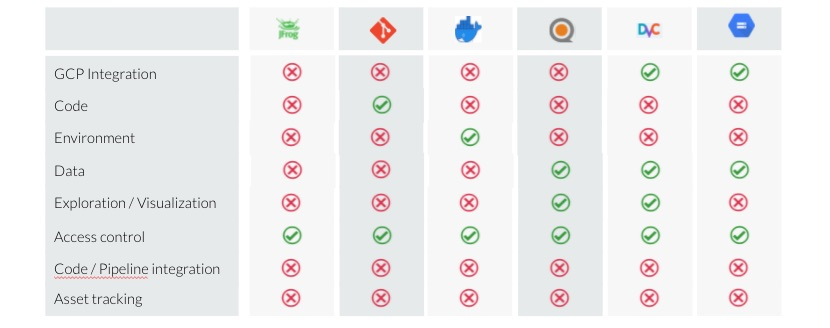

### Existing Tools
Docker and git provide a robust encapsulation of code and environment.
The git hash and docker hash represent immutable states (for code and environment respectively) that are traceable and reproducible.
There is no such system for versioning of data assets. 

QuiltData can provide storage, distribution to geographically distributed teams as well as provide visualization and exploration of the data. 
However, it works only on amazon web services and lacks support of google cloud which is our most dominant computing platform. 
In addition, it does not provide source tracing, permission control and limited code integration. 

A comparison of various tools is below:

