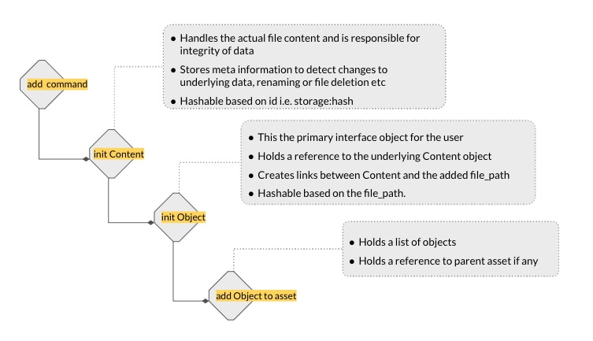

### Adding files to an asset

<pre class="code">
asset add output/logs/annotation.log
</pre>

The following actions are performed to add a file to an asset.

* Verifies if the file exists at the given path
* Calculates hash of the file and checks if a content with hash is already registered.
* If content exists, use the already stored content else create a new content and add to the contents (set) variable in the asset.
* Cache the added file by creating a hard-link from the file into the path. Given the large size of files to be handled by BaseAsset Manager we opted for hard-links instead of copying files.
* Contents can be of many types depending on where they are stored i.e. file-content, sql-content, url-content, docker-content etc.

**Ensuring atomicity of asset**
Think of scenario, user A adds few files to an asset, commits the asset but there is an interruption in the commit flow. User A,
then adds a few more files to the asset and commits the asset again.

Therefore, for every commit, the asset-client should be able to detect:
* If the asset is inheriting from another asset, whether that asset was committed successfully.
* If the parent asset was committed, we can proceed with the regular flow.
* However, if the previous commit was not successful.
    - We should ask the user, if the changes are part of the previous interrupted transaction
    - If user answers - yes, then we can proceed with committing the existing asset
    - If the user answers - No, then we need to initialize a new-asset, set parent to null and commit that asset

####Ensuring content integrity

A core principle of asset-manager is that the file-name is the md5 hash of its contents.

Data files can be very large, so in the interest of storage efficiency - when a user adds files to an asset we don't
make a copy the file. Instead we create a hardlink to the file inside the cache directory.

The hardlink is a pointer to the same inode, so whenever the user makes any changes to the files, the cached file
would be changed as well. So when a user alters the file after adding it to the asset, the file-name no longer reflects
the hash of its contents. This causes data integrity issues.

To avoid this, we need to make sure that all file-names are the same as their content hash before they are uploaded. 
We can recompute the file hashes again and make sure the filenames are same. But this presents the following problem

- computing md5 hashes is an expensive operation, especially for large files.
- The user may have deleted the file after adding, which is not handled by this approach
- The user may have renamed the file after adding

In short, we need to detect if a file has been altered, renamed or deleted before committing to the cloud. To handle this,
we take the following approach.

When user adds a file, we compute the file stat and store the following information.

- `md5 hash`
- `st_mtime` : last modified time of file meta data, changes when a file is renamed
- `st_nlink` : number of pointers to the inode of the file.
- `st_ctime` : last modified time of the file content
- `st_ino` : inode number of the file
- `st_size` : file size in bytes 

**Detecting if a file was deleted**
This is very straight forward. Once the user adds the file - we create a hardlink to the file inside the cache. Therefore
the `st-nlink` to the file should be atleast 2. If this is less than 2, then that means the file was deleted after adding.
If we detect the file is deleted, we request the readd the file to the asset or remove the file from the asset before it can be
uploaded.

**Detecting if the contents were modified**
If a file has not been deleted, we need to check if its been modified. 

We check if the st_ctime has changed. If it has changed, then we check if the st_size has changed. If st_size has changed, then
file has been altered - we don't need to compute the md5 for that. We take this approach, so that we can defer computing md5 hash,
which is expensive - until we must. If st_ctime has changed but size is same, then we compute the md5 and compare with the stored value.

**Detecting if a file has been renamed**
This is tricky. Any change in name will change the `st_mtime`, but there are other things that can change the `st_time` as well.
For example, the user might change the name and revert it back, which will also change the `st_mtime`. So detecting renaming
involves a few workarounds.

If a file has neither been deleted or altered. We check if it has been renamed.

We first check if `st_mtime` has changed. If not - then we can be sure, it's not been renamed. If the `st_mtime` has changed,
we find the object(s) that refer to the same file and compute the inode numbers of the path they point to. If the inode numbers are same,
then the link is valid and there is no renaming. If the inode numbers are different, then it's a different file with the same name. 
The linked file has been renamed. So we prompt the user to remove the old file.

 