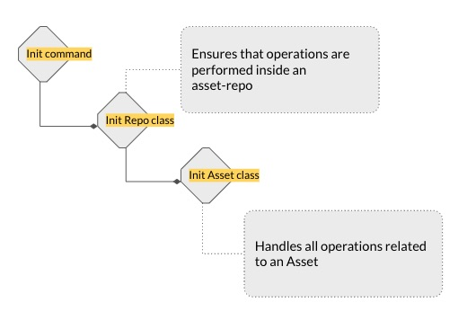

### Initializing an Asset

<pre class="code">
cd your_dir
asset init class_name
</pre>

The following steps are performed.




**Create Repo instance**

- The Repo class checks if we are currently at the root or inside an already existing asset-repo
- If no asset-repos are found, the Repo class initializes a repo by creating a .assets directory at <your_dir>

**Create Asset instance**

- We create a new asset-manifest.yaml file at the root of the asset-repo, this file is a serialized representation of the Asset instance
- We create cache directory inside the .assets dir (if not already exists). This is used to cache all files added to an asset

If there is an existing asset-manifest.yaml file which has uncommitted changes, and the user calls ```asset init```, we should ask the user to commit
the changes first or lose them. If the user decides to commit the changes - we upload the asset.

If the user decides to lose the changes, we revert the asset to parent.

**How do we find if there are uncommitted changes.**

- When users add a new file to an asset, if the asset_id is not null, we move asset_id to parent_asset_id and make asset_id as null.
- we retain the seq_id, since this asset will be a new version of the parent
- When the user removes a file, we check if the parent_id is not null, we compare the asset's hash to parent's hash, if they are same,
  we make parent_id as asset_id and parent.parent_id as the asset.parent_id
- How do we compare two assets, we compare the assets by their hash which is a hash of all objects in the asset
- What's a commit-hash, a commit-hash is the hash of the asset which has been successfully committed to the database

If the user calls ```asset init```

- make asset_id as null - server will assign asset_id
- make parent as null - server will assign parent id
- make seq_id as null - the server will assign seq_id