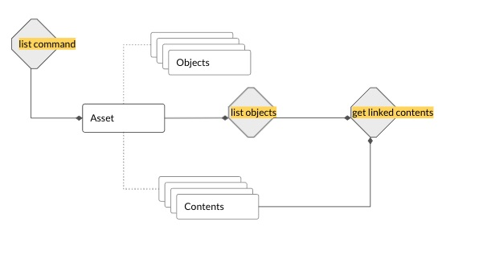

### Listing Files in Asset

<pre class="code">
asset list
</pre>

The following steps are performed.



* get the list of all objects in the asset ```list(asset.objects)```
* each object has a ref to its content i.e. ```object.content``` for each object, get the ```content_hash```, ```content_type```
* list in table format