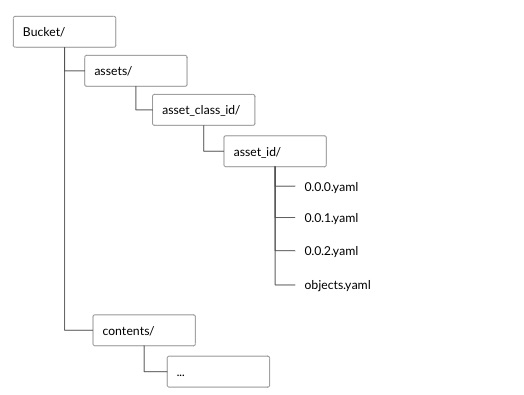

### Asset Storage Structure in Bucket

**assets** is a directory inside the bucket. This directory holds a list of directories which are the ids of all the
asset classes.

**asset_class_id** is a directory inside assets. This directory holds of list of directory, each of which are the
ids of all the assets in that class

**asset_id** is a directory inside asset_class_id. This holds a list files

- objects.yaml: holds the list of all objects that the asset refers to
- asset.yaml: holds the root information of the asset, this is a yaml representation of the asset record from db
- version.yaml: holds the changes relevant to that version, this is a yaml representation of the version record from db