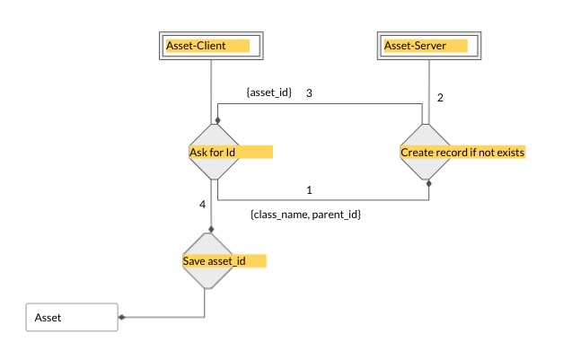

#### Commit BaseAsset
After the files are successfully uploading to staging area, we identify the linked objects to those files. These objects
can now be committed to the asset. The asset and object are committed together since they are inter-linked. 

The BaseAsset-commit process is a handoff to the asset-server which performs the following steps. The BaseAsset-server receives the request from asset-client. The payload is in the following format
<pre class="code">
{
  "class_id": 483b14fa-b0ea-4cf0-8640-afdd76f8dcf1
  "parent_asset_id": 123e4567-e89b-12d3-a456-426614174000,
  "alias": "my_asset",
  "objects": [...],
  "patch": "...",
}
</pre>

##### Ensuring Atomicity of the BaseAsset-Commit process
Its possible, that the previous commit was interrupted and didn't go through. A few possible reasons could be

* **Network failure with User**: Content staging was successful, but a network error happened at the user-end during the commit process. In such a case
  the asset-client will try to first complete the previous commit before initiating a new transaction. The server should 
  expect to receive the same payload next-time since the transaction was not completed.
  
* **Network failure with Server**: Similar issue as the above but this time, there was an error on the server-side in either gcs access
or database access
    
* **User Interruption**: i.e. ctrl + c

To ensure atomicity, we need to make sure the previous transaction was committed successfully. In order to achieve this we break-down the
asset-commit flow into 2 different stages. 

**BaseAsset Commit flow - Stage 1**



In stage-1 the ```BaseAsset-Client``` checks if the asset to be committed has an id, if not, it requests for an id to the asset-server. The request payload
contains the class_name, and the parent_asset_id (if asset inherits from a different asset). The ```BaseAsset-Server``` receives the request, creates a record
in the asset-table (with seq_id and version) and returns the asset_id to the Client. 

**BaseAsset Commit flow - Stage 2**

In stage-2, the asset-client requests for the asset to committed. The commit process involves the following steps.

* Transfer contents from staging area in to remote-repo, do checksum validation.
* Create records in Content table, if not exist already
* Create records in Objects table, if not exist already
* Create records in BaseAsset-Objects join table
* Update asset-record with commit-hash
* Respond to client with commit-hash


If the commit process is successful, the asset-server updates the asset-record with a commit-hash
and returns the commit-hash to client. Any time, the asset-client initiates a commit, it first checks if the existing asset has a commit-hash, if it finds a commit-has
this means the previous commit was successful, so the client then moves to follow the 2 stage process. 
If the previous commit was unsuccessful, the client will initiate stage-2 again i.e. commit the previous asset along with new updates if any.

**The Previous transaction got interrupted now user wants to add more files to assets**


To verify, check if the previous record created by the same user with node_type and node_name
    has a commit_hash. If commit_hash is missing - then we presume the current updates are also part of the
    same commit and we try to recommit.