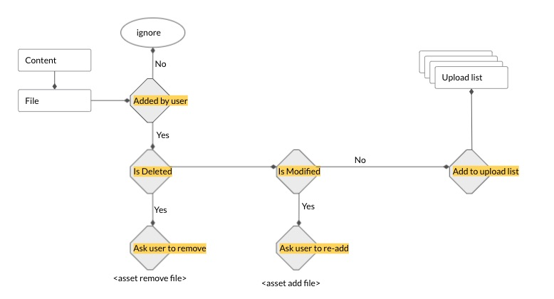
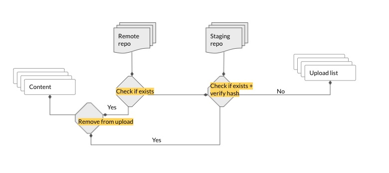
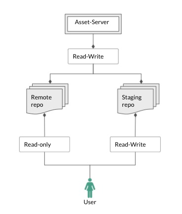
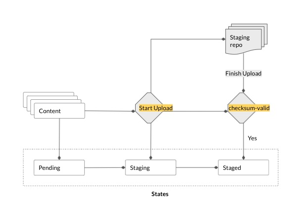

#### Find Files to be Uploaded

Once we have the class_id and top_hash - the asset-contents can be uploaded to staging area. We now query the asset to get a list of files that
require to be uploaded. To maintain data integrity, a file must meet the following conditions in order to be a
candidate for upload.

* added by the user
* have not been deleted, modified or renamed

Since the file sizes can be very large, in asset-manager, we took the approach of not copying files. Therefore,
in order to accomplish the above requirements when a file is added to asset, we compute and store metadata about the file
<pre class="code">
st_mtime: timestamp (last modified time of the file content) 
st_nlink: int (# of hardlinks to the file)
st_ctime: timestamp (last modified time of file meta data)
st_ino: int (inode number i.e. disk storage pointer for the file)
</pre>

Before uploading, we recompute the file metadata and compare with the stored values to identify if a file has been
altered by the user after adding it to asset.

#### Exclude content already available in cloud
In asset-manager we use the md5 hash of the files for storage and indexing. Its possible, that a user might be adding
a file which already exists in the cloud and is indexed. In which case, the files need not be uploaded again. Therefore,
after determining the list of files to be uploaded, we check if any of the files exist in the remote storage.

If the file is already indexed it would exist in the remote repo, if another user is in the process of uploading the file
and its yet to be indexed then it would exist in the staging area. Therefore, we check both remote-repo and staging-repos.

##### User access
Staging and remote buckets are separate by design to maintain data integrity. For staging buckets, individual user will have
write acess where as for remote buckets, only the asset-server will have write-access. Individual users will have readonly-access
to the remote bucket.

#### Upload Files to Staging

We use asyncio for fast concurrent network calls. The staging area is namespaced to the top-hash of the asset-class. 

