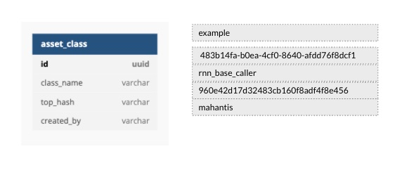

#### Asset Class
Conceptually, the Asset class is a classification of similar types of assets
depending on the use case. You could define a bio_nlp asset-class to store a relevant assets pertaining to the
bio_nlp annotators. Similarly, you might declare a dl_training or rnn_base_caller asset-class to manage all their relevant
assets. All assets belonging to an asset-class share the same storage in bucket, which helps optimize storage requirements
since files with the same content need not be uploaded again.

