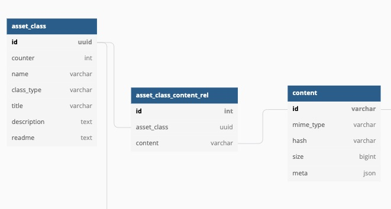

#### Content
A Content is an abstraction for stored data. Contents are immutable.

* Contents are stored in the bucket and their metadata is stored in the Contents Table in the database
* Contents can be of many types depending on where they are stored
    - file-content
    - sql-content 
    - url-content 
    - docker-content etc.

##### Managed-Content vs Proxy-Content
* Managed-Content is where the storage of the underlying data is in control of the asset-manager. This is the default content type
  that gets created when you add any file / data to an asset.
* Proxy-Content is where users actively manage where their data is stored but still want to use asset-manager for storage, retrieval, sharing
  and version control of data. For example, users may want to store data in google buckets and directly access those (without using asset-manager). 
  This situation is especially useful where teams want to have minimal friction of using a data-handling tool like asset-manager.
  In other cases, users may want to add pre-existing cloud data without increase any cost of additional storage. For example, dna_sequence raw data 
  can often be in size of multiple magnitudes of terrabytes, any duplication of which (in creating to managed-content) can add large cost overheads.
* An key limitation of using proxy-content is that asset-manager can not guarantee availabilty of data since users can modify / delete the data
  at source. However asset-manager can still be used to index the proxy-contents for lineage tracing in experiments.

##### Calculating ID for Content
* The id of a managed-content is a combination of its md5 hash of data and its storage system i.e. `gs:md5_g5XolPRH7VkE8Yanh8oyzQ==`. The rationale behind composite key
  is to allow the same content to be stored in multiple locations if required. For example: depending on the use case, we may want to have a copy of 
  output stored in gcs bucket and in a database or bigquery. 
* On the other hand, the id of proxy-content has the following form `gs:proxy_md5_g5XolPRH7VkE8Yanh8oyzQ==`. The `proxy` flag shows that it's a proxy content.
  However, unlike the managed-content, the md5 hash here is a hash of the string `src_url:content_hash`. 
  