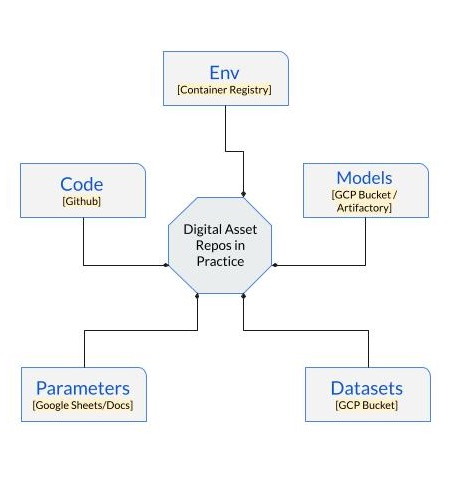

# The Problem

The explosion in data science activities has created a new set of challenges when it comes to generating, managing
and using the assets involved. A typical data science experiment involves:

* **Code**: This would be any custom code you implement in your activity. Your GitHub repo provides source control for all your code.
* **Environment**: This refers to the runtime environment in which your code is executed. It comprises the OS, 
  Language runtime(Python, Java version etc), your package-manager (conda, pip etc) and package-control. When running locally
  your IDE handles this - for running in cloud, we package the environment in a Docker Image. There is no version control 
  with Docker but Docker does provide a sha256 for each image.

* **Models**: These refer to the model files (TF2 or HDF5) that are used in your activity. These are currently stored either in Artifactory
or GCS Buckets. There is no version control for models.
  
* **Datasets**: These refer to the collection of separate pieces of data that is used for training. These are currently stored in GCS Buckets.
  There is no version control for Datasets.
  
* **Parameters**:  These refer to the parameters used for model training. These are stored in GoogleSheets and are not version-controlled.  
